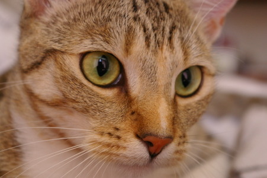

# Photomosaic
Generate photomosaic using Scikit-image and Photomosaic. Input images are taken from skimage/data. The intermediate experimentation tiles are present in folder /square.  

Input: 
 

Run : python pm.py 100 100 chelsea100x100.png 
Output :  
 

Run : python pm.py 300 300 chelsea300x300.png 
Output :  
 

Run : python pm.py 500 500 chelsea500x500.png 
Output :  
 
